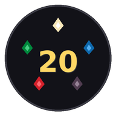
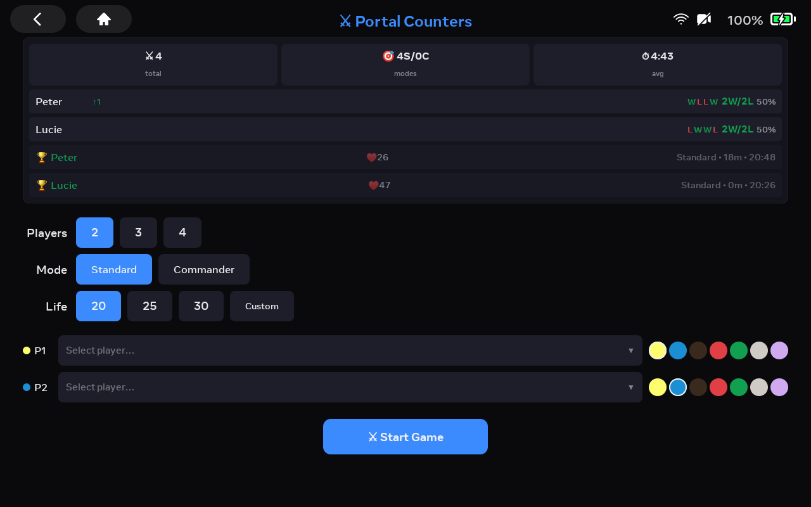
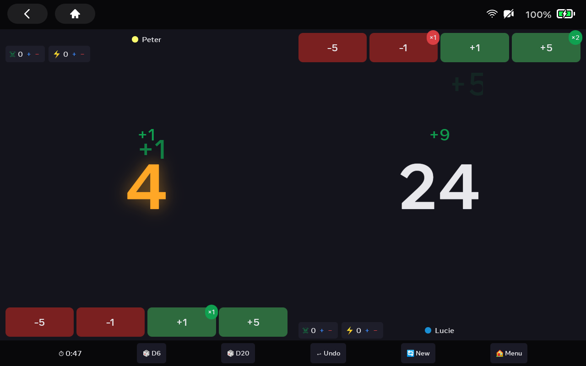
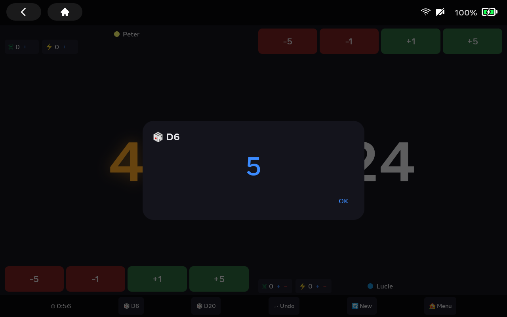
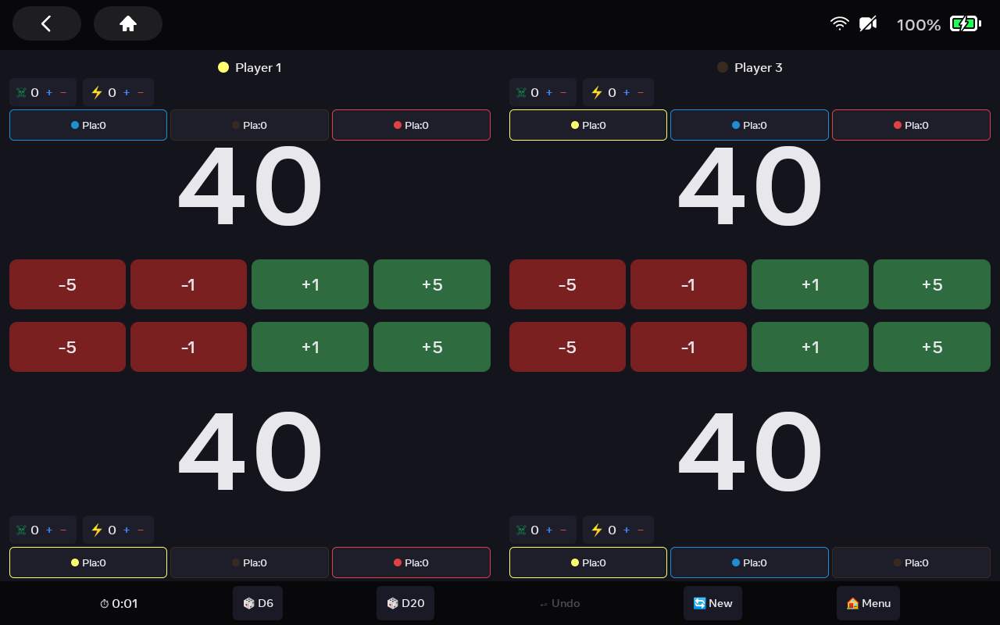

<p align="center">
  
</p>

<h1 align="center">Portal Counters — Magic: The Gathering Life Counter for Meta Portal Go</h1>

<p align="center">
  <strong>A free, open-source Magic: The Gathering life counter, commander damage tracker, and dice roller built for the Meta Portal Go 10″ touchscreen.</strong>
</p>

<p align="center">
  <a href="#features">Features</a> ·
  <a href="#screenshots">Screenshots</a> ·
  <a href="#installation">Installation</a> ·
  <a href="#building-from-source">Building from Source</a> ·
  <a href="#supported-devices">Supported Devices</a> ·
  <a href="#tech-stack">Tech Stack</a> ·
  <a href="#contributing">Contributing</a> ·
  <a href="#known-limitations">Known Limitations</a> ·
  <a href="#license">License</a>
</p>

---

Portal Counters turns a discontinued Meta Portal Go into a dedicated tabletop companion for Magic: The Gathering games. The large 10.1″ landscape display shows all players simultaneously — no more passing a phone around the table.

## Features

### 🎮 Game Modes
- **Standard** — 2–4 players, 20 / 25 / 30 starting life, or any custom value
- **Commander / EDH** — 2–4 players, 30 / 40 / 50 starting life with per-player commander damage tracking

### ❤️ Life & Counter Tracking
- **Life totals** with ±1 and ±5 buttons, animated floating damage/heal numbers
- **Poison counters** (☠) — game ends at 10 poison
- **Energy counters** (⚡) — track energy generators
- **Commander damage** — per-opponent damage breakdown (Commander mode); a player dies when they take 21+ damage from a single commander
- **Full undo history** — every action can be reversed, including lethal actions
- **Counter clamping** — poison, energy, and commander damage cannot go below 0

### 🎲 Dice Roller
- Built-in **D6** and **D20** dice — no more reaching for physical dice

### 🔊 Sound Toggle
- Mute/unmute sound effects with a toggle button in the control bar
- Preference persists between sessions

### 🏆 Stats & Game History
- **Player leaderboard** — wins, losses, win rate percentage, current streak
- **Recent form tracker** — W/L pattern for the last 5 games per player
- **Head-to-head stats** — who beats whom, how often
- **Game history** — saved when you leave a completed game (not auto-saved on lethal)
- **Streak badges** — 🔥 fire emoji for hot streaks (3+ consecutive wins)
- Last 100 games stored locally on device

### 🎨 Player Customization
- Name players from a saved roster (dropdown + "Add New")
- Assign **MTG color identity** — White, Blue, Black, Red, Green, Colorless, or Multi
- Player setups remembered between games
- Duplicate name validation prevents stats confusion

### ✨ Animations & Sound
- Screen shake on damage
- Green/red glow pulse on life changes
- Floating +N / -N text particles that drift and fade
- Scale bounce on life total updates
- **10 synthesized sound effects** — 5 damage sounds (hit, crunch, sting, doom, dark) and 5 heal sounds (sparkle, shimmer, chime, ascending, glow), randomly selected per event

### 🖥️ Optimized for Portal Hardware
- **Landscape-first** layout — 2, 3, or 4 player zones arranged for the 10.1″ screen
- Opposite players are rendered upside-down so everyone can read their own zone
- **64dp top reservation** for Portal system overlay
- **Minimum 40dp touch targets** on counter buttons — comfortable for tabletop use
- Dark theme with atmospheric colors — no pure black or white
- **Inter font** at 18sp body / 140sp life total
- **Keep-screen-on** flag — display never sleeps during a game

### ⏱️ Game Timer
- Elapsed time displayed in the control bar
- Duration saved to game history for stats

## Screenshots

<table>
  <tr>
    <td align="center"><b>Game Setup & Stats Dashboard</b></td>
    <td align="center"><b>2-Player Mid-Game</b></td>
  </tr>
  <tr>
    <td></td>
    <td></td>
  </tr>
  <tr>
    <td align="center"><b>Dice Roller (D6/D20)</b></td>
    <td align="center"><b>4-Player Commander Game</b></td>
  </tr>
  <tr>
    <td></td>
    <td></td>
  </tr>
</table>

## Installation

### Option 1: Download APK (Recommended)

Download the latest APK from the [Releases](https://github.com/pgedeon/portal-counters/releases) page.

### Option 2: Sideload via ADB

```bash
# Enable ADB on your Portal Go:
#   Settings > Device Info > tap "Build" 7 times > Developer Options > enable ADB
# Connect via USB-C (port under the rubber cover on Portal Go)

adb install portal-counters.apk
adb shell am start -n com.pgedeon.portalcounters/.Main
```

### Option 3: Build from source (see below)

## Building from Source

### Prerequisites
- **JDK 17** (OpenJDK recommended)
- **Android SDK** with platform `android-29` and build tools `34.0.0+`
- **A Meta Portal Go** with ADB enabled, connected via USB-C

### Build & Install

```bash
git clone https://github.com/pgedeon/portal-counters.git
cd portal-counters
./gradlew assembleDebug
adb install app/build/outputs/apk/debug/app-debug.apk
adb shell am start -n com.pgedeon.portalcounters/.Main
```

### Run Tests

```bash
./gradlew test                    # Unit tests
./gradlew connectedAndroidTest   # Instrumented tests (requires device)
```

### Build Release APK

Release builds have minification and resource shrinking enabled. To build a signed release APK locally:

1. Create a keystore (if you don't have one):
   ```bash
   keytool -genkey -v -keystore release.keystore -alias portal -keyalg RSA -keysize 2048 -validity 10000
   ```

2. Add signing config to `app/build.gradle.kts` (do NOT commit secrets):
   ```kotlin
   android {
       signingConfigs {
           create("release") {
               storeFile = file("release.keystore")
               storePassword = System.getenv("KEYSTORE_PASSWORD")
               keyAlias = "portal"
               keyPassword = System.getenv("KEY_PASSWORD")
           }
       }
       buildTypes {
           release {
               signingConfig = signingConfigs.getByName("release")
           }
       }
   }
   ```

3. Build:
   ```bash
   export KEYSTORE_PASSWORD=yourpassword
   export KEY_PASSWORD=yourpassword
   ./gradlew assembleRelease
   ```

The signed APK will be at `app/build/outputs/apk/release/app-release.apk`.

## Supported Devices

Portal Counters targets the **Meta Portal Go** (10.1″ touchscreen, landscape, SDK 29) but works on any Android device running API 24+.

| Device | Screen | Connection | Status |
|--------|--------|------------|--------|
| Meta Portal Go | 10.1″ 1280×800 landscape | USB-C (under rubber cover) | ✅ Primary target |
| Meta Portal (1st/2nd gen) | 10″/15.6″ | USB-C | ✅ Compatible |
| Meta Portal+ | 15.6″ | USB-C | ✅ Compatible |
| Meta Portal Mini | 8″ | USB-C | ✅ Compatible |
| Meta Portal TV | TV (no touch) | USB-C | ⚠️ No touch input — D-pad support not yet implemented |
| Other Android tablets | Any | USB / wireless | ✅ Should work |

## Tech Stack

| Component | Technology |
|-----------|-----------|
| Language | [Kotlin](https://kotlinlang.org/) |
| UI Framework | [Jetpack Compose](https://developer.android.com/compose) with [Material 3](https://m3.material.io/) |
| Architecture | Single-activity Compose app |
| State Management | Compose mutable state + sealed class actions with undo history |
| Persistence | `SharedPreferences` with JSON serialization |
| Audio | `SoundPool` for low-latency SFX |
| Build | Gradle (AGP), Kotlin Compose plugin |
| Min SDK | 24 (Android 7.0) |
| Target SDK | 29 (Android 10 — Portal hardware) |
| Font | Inter via XML bundled fonts |
| Animations | Compose Animatable, spring physics, keyframe sequences |

## Project Structure

```
app/src/main/java/com/pgedeon/portalcounters/
├── MainActivity.kt              # Entry point, navigation, deferred game saving
├── audio/
│   └── SoundManager.kt          # SoundPool-based SFX with mute support
├── data/
│   └── GameStorage.kt           # SharedPreferences: game history, player names, sound pref
├── model/
│   └── GameState.kt             # Game state: players, actions, undo, death detection, counter clamping
└── ui/
    ├── ControlBar.kt            # Bottom bar: timer, dice, undo, sound toggle, new game, menu
    ├── GameScreen.kt            # Active game layout with SoundPool lifecycle management
    ├── GameSetupScreen.kt       # Pre-game: config, validation, stats dashboard
    ├── PlayerZone.kt            # Player zone: life, buttons, counters with 40dp touch targets
    └── theme/
        ├── Color.kt             # MTG color palette, dark theme tokens
        ├── Theme.kt             # Material 3 theme
        └── Type.kt              # Inter font family + 140sp life total style
```

## Known Limitations

- **No Planeswalker loyalty counters** — not yet implemented.
- **No custom counter types** — energy is tracked but arbitrary counters are not supported.
- **Portal TV D-pad support** — the app requires touch input; D-pad/remote control navigation is not implemented.
- **No data export** — game history cannot be exported as CSV/JSON.
- **Stats keyed by player name** — changing a player's name creates a separate stats entry. Duplicate names in the same game are blocked at setup.
- **SoundPool resource** — SoundPool is created per game screen session. While it's released via `DisposableEffect` when leaving the game, rapid screen switching could cause brief audio glitches.
- **No Material You** — dynamic color is disabled to maintain consistent dark theme on Portal hardware.

## Roadmap

- [ ] Planeswalker loyalty counter support
- [ ] Custom counter types (experience, +1/+1, etc.)
- [ ] Portal TV D-pad / remote control support
- [ ] Material You theming for non-Portal devices
- [ ] Game replay / turn-by-turn history
- [ ] Export stats as CSV/JSON

See [open issues](https://github.com/pgedeon/portal-counters/issues) for the full list.

## Contributing

Contributions are welcome! This is a hobby project for repurposing discontinued hardware.

1. Fork the repo
2. Create a feature branch (`git checkout -b feature/amazing-feature`)
3. Commit your changes (`git commit -m 'Add amazing feature'`)
4. Push to the branch (`git push origin feature/amazing-feature`)
5. Open a Pull Request

See [CONTRIBUTING.md](CONTRIBUTING.md) for detailed guidelines and [STYLE_GUIDE.md](STYLE_GUIDE.md) for Portal-specific UI requirements.

## Frequently Asked Questions

### Do I need a Meta Portal device?
No — the app runs on any Android tablet with API 24+. The UI is optimized for the Portal Go's 10.1″ landscape screen, but it works fine on other devices.

### Does this app require internet access?
No. Everything is stored locally on the device. No accounts, no cloud, no tracking.

### Can I use this for other card games?
The counter system (life, poison, energy, commander damage) is designed for Magic: The Gathering, but the life counter works for any game. Future versions may add custom counter types.

### Why target SDK 29?
Meta Portal devices run Android 10 (SDK 29). Targeting this SDK ensures maximum compatibility with Portal hardware.

### The sounds aren't playing?
Check that the 🔊 sound toggle in the control bar is not muted. The app uses `SoundPool` which should work on all Android devices.

## License

This project is licensed under the MIT License — see the [LICENSE](LICENSE) file for details.

Based on the [Meta Portal Sample App](https://github.com/meta-quest/portal-sample-app) template. Original Meta code is Copyright © Meta Platforms, Inc. and affiliates, licensed under MIT.

---

## Acknowledgments

Special thanks to [@facebook](https://github.com/facebook) (Meta) for [unlocking developer mode and ADB access](https://developers.meta.com/horizon/documentation/android-apps/portal-development/) when the Portal hardware line was discontinued. Instead of bricking the devices, Meta chose to let owners sideload any Android app — turning what would have been e-waste into fully programmable 10-inch Android tablets. That decision saved countless Portal Go units from the landfill. This app exists because that door was left open.

💜 Repurpose > landfill.

---

<p align="center">
  Made with ⚔ for the <a href="https://magic.wizards.com/en/formats/magic-gathering">Magic: The Gathering</a> community and the <a href="https://developers.meta.com/horizon/documentation/android-apps/portal-development">Meta Portal</a> ecosystem.
</p>
